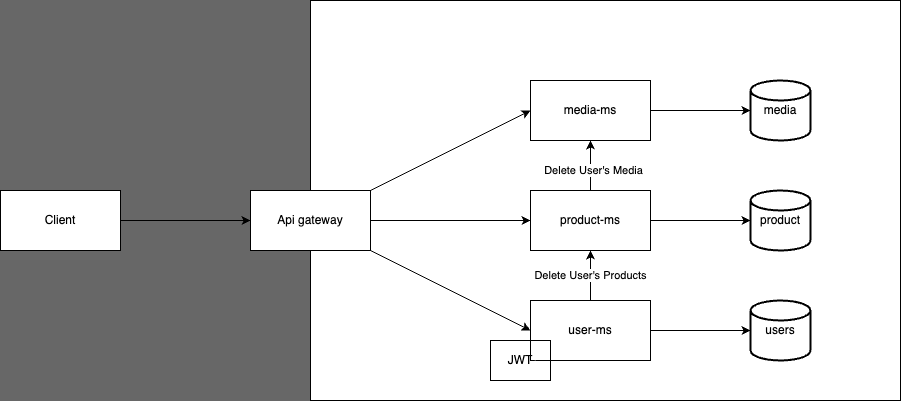

# E-Commerce Platform with Spring Boot and Angular

Welcome to our e-commerce platform, an end-to-end solution built with Spring Boot microservices for the backend and Angular for the frontend. This platform caters to both clients and sellers, offering user registration, authentication, and comprehensive product and media management.

## Features

- **User Registration**: Users can sign up as either clients or sellers.
- **Authentication**: Secure login system with role-based access control.
- **Product Management**: Sellers can create, read, update, and delete products.
- **Media Management**: Sellers can upload and manage product images with a 2MB size limit.
- **Frontend**: Angular-based user interfaces for registration, product listing, and media management.

## Getting Started

### Prerequisites

- Java JDK 17
- Maven
- Node.js and npm
- MongoDB
- Kafka

### Installation

1. Clone the repository:

   ```shell
   git clone https://01.gritlab.ax/git/AntonW/buy-01.git
   ```

2. Navigate to the backend and install the backend dependencies with Maven:
   ```shell
   cd backend
   mvn install
   ```

3. Start the MongoDB server:
   ```shell
   mongod
   ```

4. Start the backend services with Maven. Make sure to set the working directory for each microservice if you are running them from an IDE like IntelliJ IDEA. For `UserMsApplication`, set the working directory to the `backend` folder:
   ```shell
   mvn spring-boot:run
   ```

5. Navigate to the frontend directory and install the frontend dependencies with npm:
   ```shell
   cd frontend
   npm install
   ```

6. Start the Angular frontend with the Angular CLI:
   ```shell
   ng serve
   ```

7. Navigate to `http://localhost:4200` in your browser to view the application.

### IntelliJ IDEA Configuration for `UserMsApplication`

To run `UserMsApplication` from IntelliJ IDEA and ensure it locates the `.env` file and other resources:

- Open the **Run/Debug Configurations** dialog.
- Select your `UserMsApplication` configuration.
- Set the **Working Directory** to the root of the `backend` directory, e.g., `/Users/anton.wiklund/buy-01/buy-01/backend`.
- Apply the changes and run the application.

## Visual Overview



For a more detailed guide on setting up and running the individual microservices, please refer to the documentation provided within each service's directory.